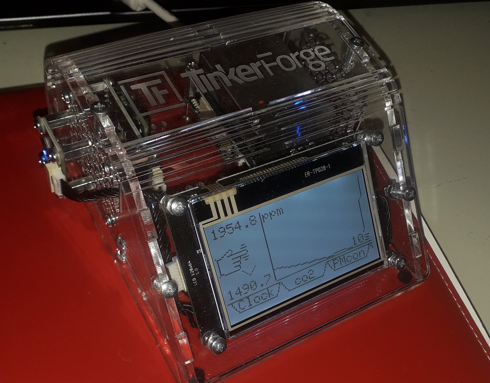
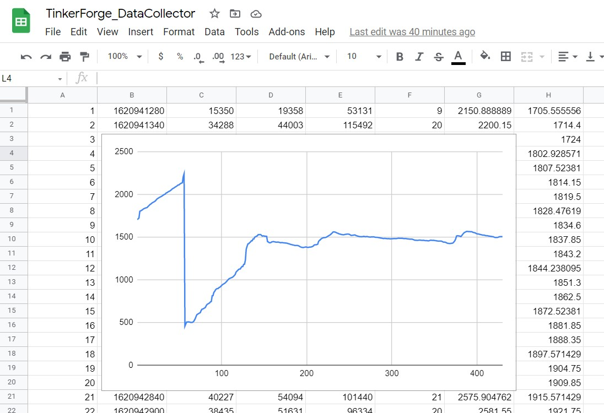

# TinkerForgeCustomWeatherStation

This is an updated version of demo application for [Tinker Forge weather station](https://github.com/Tinkerforge/tabletop-weather-station). Code is written and tested in python 3.7.4 with libraries specified in [requirements.txt](./requirements.txt).

It includes viewing values of these sensors on [LCD display](https://www.tinkerforge.com/en/doc/Software/Bricklets/LCD128x64_Bricklet_Python.html):
* [Air Quality Bricklet](https://www.tinkerforge.com/en/doc/Hardware/Bricklets/Air_Quality.html)
* [CO2 Bricklet 2.0](https://www.tinkerforge.com/en/doc/Software/Bricklets/CO2V2_Bricklet_Python.html)
* [Particulate Matter Bricklet](https://www.tinkerforge.com/en/doc/Software/Bricklets/ParticulateMatter_Bricklet_Python.html)


Additional "bonus", I added, is writting data to google spreadsheet, for additional graphs or just sending and saving data to gdrive for no specific reason. This should not be used to send big chunks of data. (see [value_db.py](./src/value_db.py) and take care of you gserviceaccount beforehand)

Before running, you need to install Brick Daemon according to instructions [here](https://www.tinkerforge.com/en/doc/Embedded/Raspberry_Pi.html).

Start with
```
./src/tabletop_weather_station.py 
```

Box


Spreadsheet data

